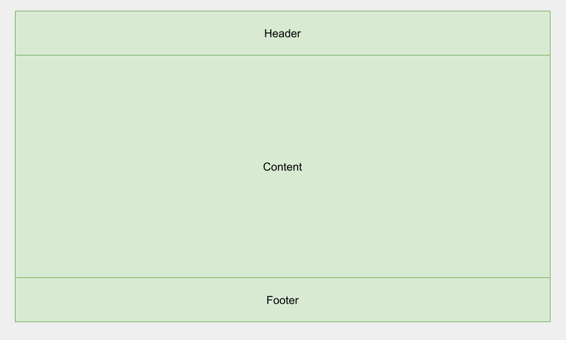
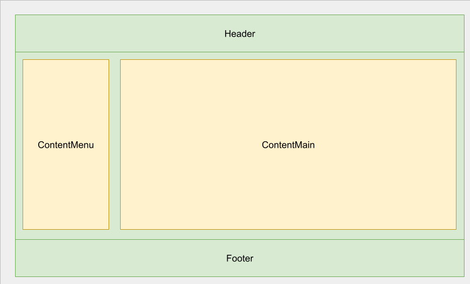
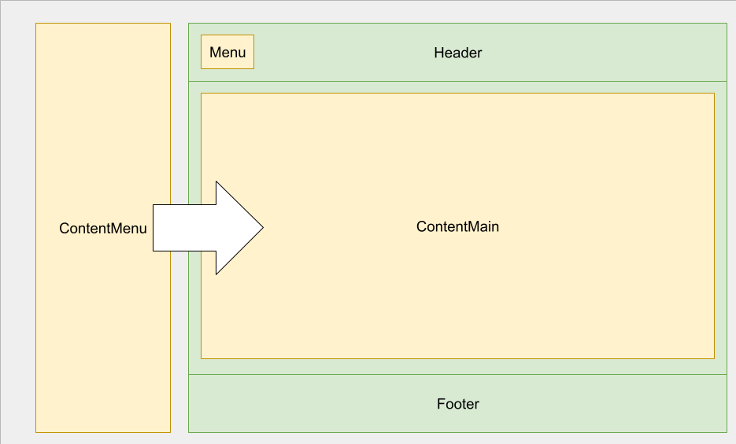

# Layout
Раскладка компонентов интерфейса реализуется при помощи компонента Layout, который в своей основе использует традиционную структуру из заголовка, контента и футера.



Весь интерфейс центрируется на экране. Максимальная ширина всех компонентов раскладки определяется переменной:

```
--alxgrn-layout-width: 1024px;
```

Заголовок закреплен вверху страницы и имеет непрозрачную подложку шириной во весь экран.

Пока экран браузера превышает значение `--alxgrn-layout-width`, внутри контента отображается основное меню (если передано из приложения):



В мобильной версии сайта происходит адоптация раскладки: основное меню убирается с экрана, контент занимает всю ширину, а в заголовке появляется переключатель для показа основного меню в выезжающем сайдбаре.



